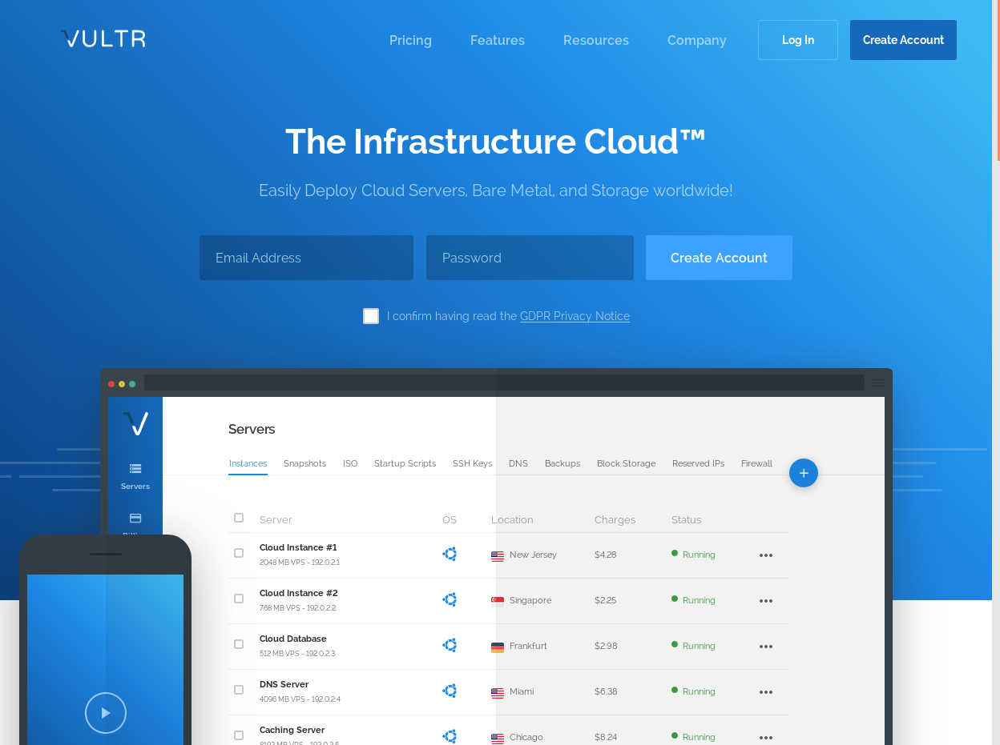

# Vultr VPS

This guide will walk you through setting up your first VPS (Virtual Private Server) on Vultr.com.  If you want you can use [my affiliate link](https://www.vultr.com/?ref=7466438) to sign up and give me a little kickback.

Vultr is a particularly good choice for hosting masternode VPS thanks to its free IPv6 support.  This allows multiple IP addresses per server and means you can run multiple nodes of the same coin on the same VPS if you want.  Even better you can pay them in BTC (though you have to set up a fiat payment method like paypal or a credit card before you can start setting up VPS).

If I've helped you on your crypto journey and you want to say thanks, any spare BTC is welcome: `38ZpM7YDKJXP8FjRHWCihdjiKcsVnoNffc`

---

## Deploying your VPS

---

## Good Housekeeping

---

## Adding additional IPs (IPv4 nodes only)

If I've helped you on your crypto journey and you want to say thanks, any spare BTC is welcome: `38ZpM7YDKJXP8FjRHWCihdjiKcsVnoNffc`

---

This work is licensed under a [Creative Commons Attribution-NonCommercial-NoDerivatives 4.0 International License](http://creativecommons.org/licenses/by-nc-nd/4.0/)
